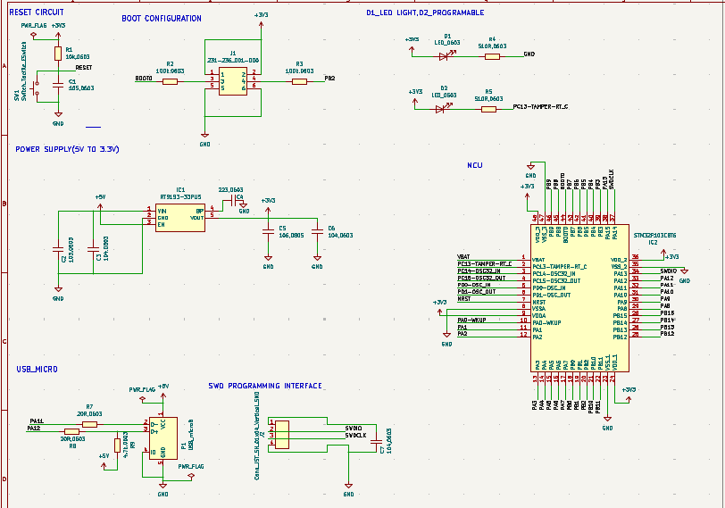
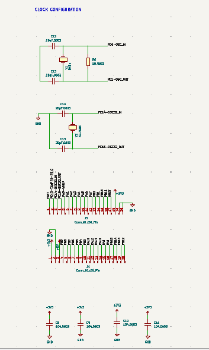
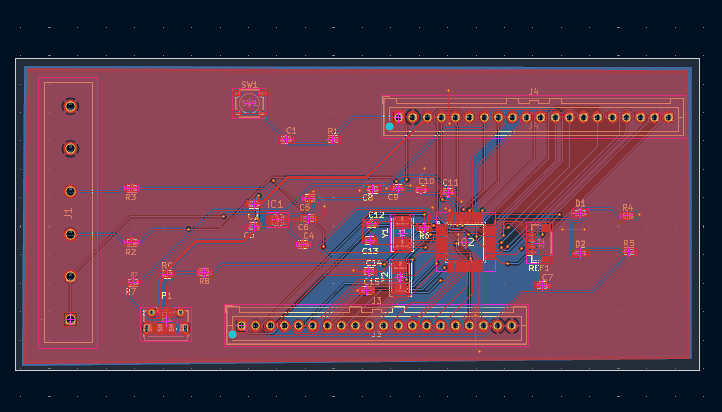
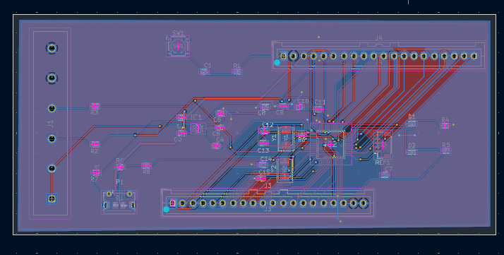

# STM32 Blue Pill PCB Design

## Overview

This project presents the PCB design of an STM32 Blue Pill Development Board created using **KiCad**. The design is based on a reference STM32F103C8T6 development board and was developed as part of PCB design learning and practice.

The project covers the complete PCB design workflow, including schematic design, PCB layout, design verification, and Gerber generation.

---

## Features

- STM32F103C8T6 Microcontroller
- USB Micro Interface
- 5V to 3.3V Power Supply
- Reset Circuit
- Boot Configuration
- SWD Programming Interface
- Clock Configuration
- Status LED
- 2-Layer PCB Design

---

## Software Used

- KiCad

---

## Hardware Components

- STM32F103C8T6
- AMS1117-3.3 Voltage Regulator
- USB Micro Connector
- Push Button
- LEDs
- Crystal Oscillator
- Capacitors
- Resistors
- SWD Header

---

## Design Flow

1. Schematic Design
2. ERC Verification
3. PCB Layout
4. Component Placement
5. PCB Routing
6. DRC Verification
7. Gerber Generation

---

## Design Verification

- ERC Passed ✅
- DRC Passed ✅
- Gerber Files Generated Successfully ✅
- Ready for PCB Fabrication ✅

---

## Repository Structure

```
STM32_Blue_Pill_PCB_Design
│
├── STM32_BluePill.kicad_sch
├── STM32_BluePill.kicad_pcb
├── README.md
│
├── Gerber/
│
└── Images/
    ├── STM32_Schematic_1.png
    ├── STM32_Schematic_2.png
    ├── STM32_PCB_TopLayer.png
    └── STM32_PCB_BottomLayer.png
```

---

## Project Images

### Schematic - Part 1



---

### Schematic - Part 2



---

### PCB Layout - Top Layer



---

### PCB Layout - Bottom Layer



---

## Learning Outcomes

- Designed a complete STM32 development board in KiCad.
- Learned schematic capture and component placement.
- Performed PCB routing for a two-layer board.
- Verified the design using ERC and DRC.
- Generated Gerber files for PCB fabrication.

---

## Author

**Indhira A**

Electronics and Communication Engineering Student

Interested in Embedded Systems, PCB Design, and IoT.
